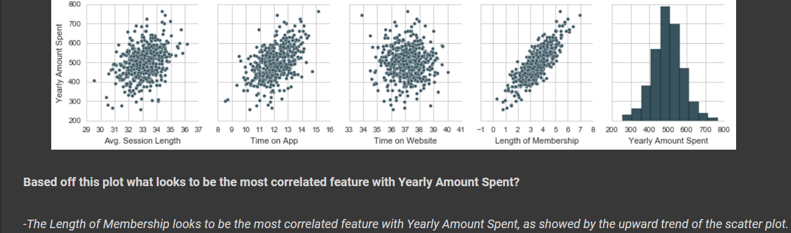
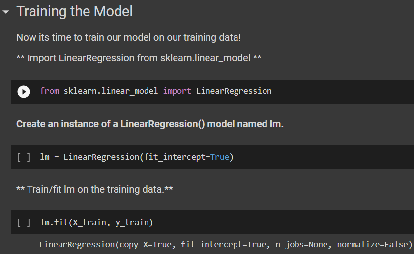
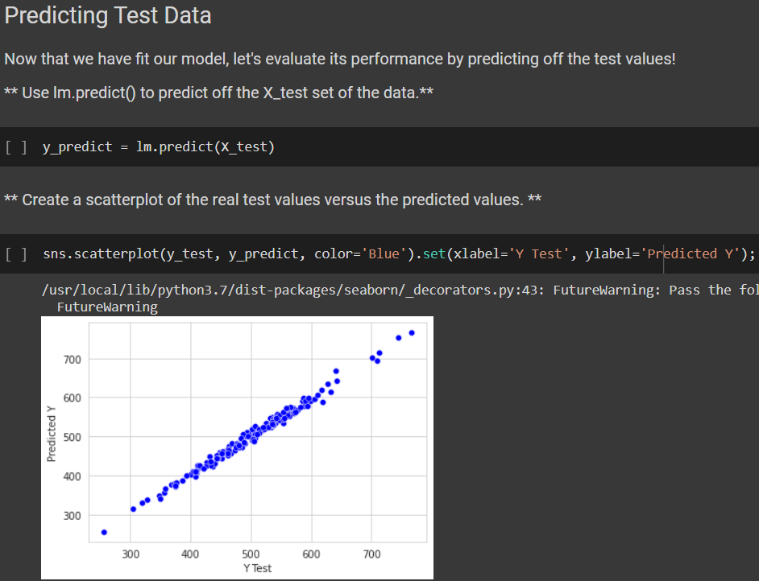
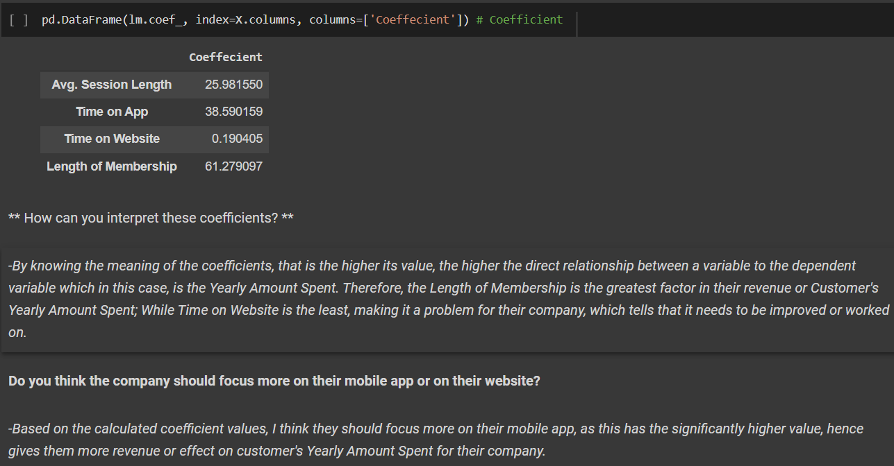

# Forecasting with Linear Regression
#### *DISCLAIMER: This is part of our exercises in Elective Subject as BSCpE students. Credits go to our professor, Dr. Renato R. Maaliw III.*
*Data sets used are available in our professor's GitHub Page, https://github.com/renatomaaliw3/public_files/tree/master/Data%20Sets .*

*To run this notebook, Python 3 and Jupyter Notebook should be installed, which are both available in [Anaconda Package](https://www.anaconda.com/products/distribution).*
*This can also run in [Google Colabs](colab.research.google.com).*

  

### -A set of exercises that I have answered as to represent my skills in data science using Python with SciKit-learn such as:
- Knowing the feature of a data set with apparent correlation from Seaborn Pairplot.
  - 
- Training a model like Linear Regression, with given data set. 
  - 
- Predicting the future data with given model, and comparing it with test set, by plotting both in scatter plot.
  - 
- Making a conclusion based on calculated values like coefficients of the model.
  - 
