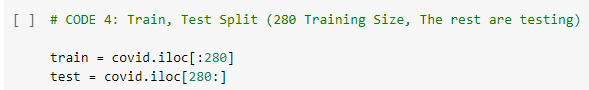
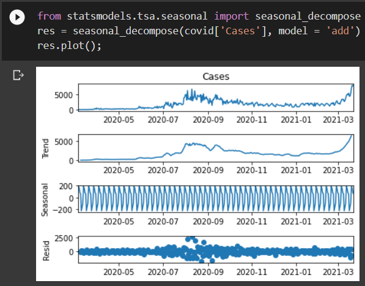
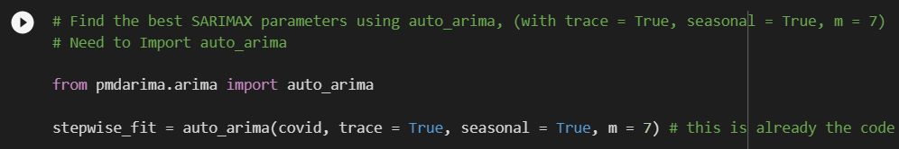

# Forecasting with Seasonal Auto-Regressive Integrated Moving Average with Exogenous Factors (SARIMAX)
#### DISCLAIMER: This is part of our exercises in Elective Subject as BSCpE students. Credits go to our professor, Dr. Renato R. Maaliw III.
Data sets used are available in our professor's GitHub Page, https://github.com/renatomaaliw3/public_files/tree/master/Data%20Sets .

To run this notebook, Python 3 and Jupyter Notebook should be installed, which are both available in [Anaconda Package](https://www.anaconda.com/products/distribution).

This can also run in [Google Colabs](colab.research.google.com).

### -A set of exercises that I have answered as to represent my skills in machine learning using Python with SciKit-learn such as:
- Splitting data set to training sets and test sets for appropriate model like data with linearity, for prediction.
  - 
- Knowing the data's description if there is trend, seasonality, and others with Seasonal Decomposition Plots.
  - 
- Optimizing a model with Pyramid Auto-Arima, to find optimal paramaters for it.
  - 
