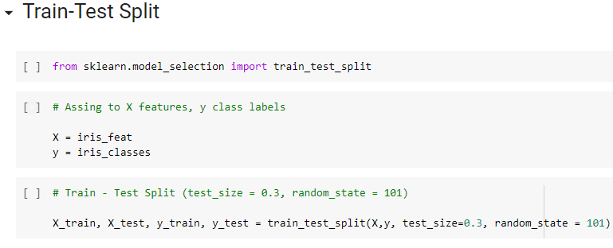
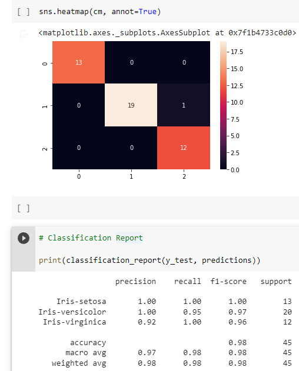
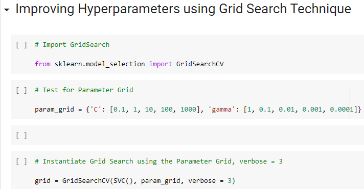

# Forecasting with Support Vector Machine (SVM)
#### *DISCLAIMER: This is part of our exercises in Elective Subject as BSCpE students. Credits go to our professor, Dr. Renato R. Maaliw III.*
*Data sets used are available in our professor's GitHub Page, https://github.com/renatomaaliw3/public_files/tree/master/Data%20Sets .*

*To run this notebook, Python 3 and Jupyter Notebook should be installed, which are both available in [Anaconda Package](https://www.anaconda.com/products/distribution).*

*This can also run in [Google Colabs](colab.research.google.com).*

  

### -A set of exercises that I have answered as to represent my skills in Statistics Learning using Python with SciKit-learn such as:
- Splitting data set with Scikit-learn's method, which could work for models like this one, and some classification models.
  - 
- Showing accuracy of predictions compared to actual test data with Confusion Matrix and Classification Report.
  - 
- Improving predictions by finding Hyperparameters using Grid Search Technique. 
  - 
