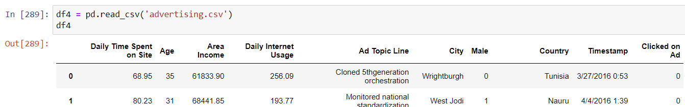
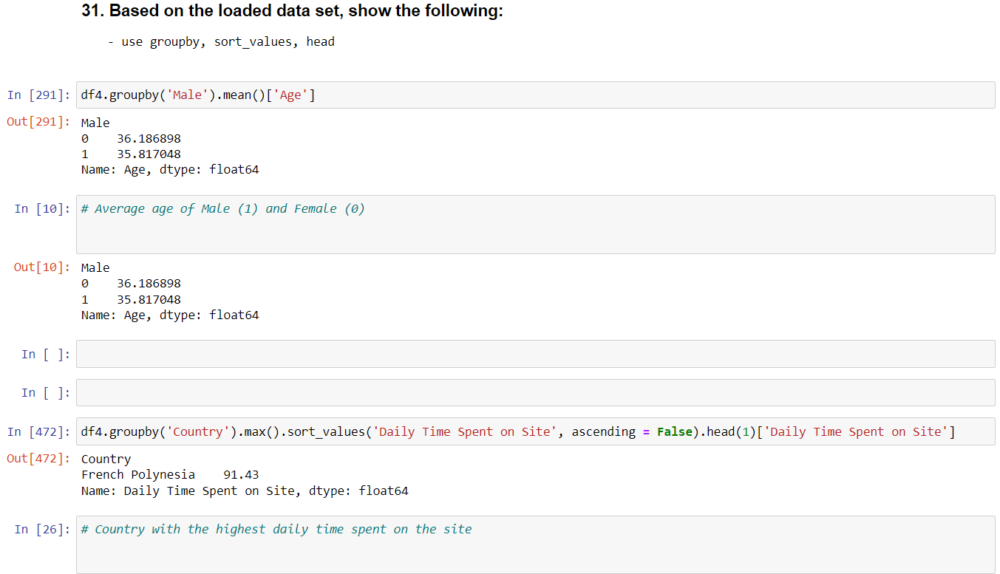
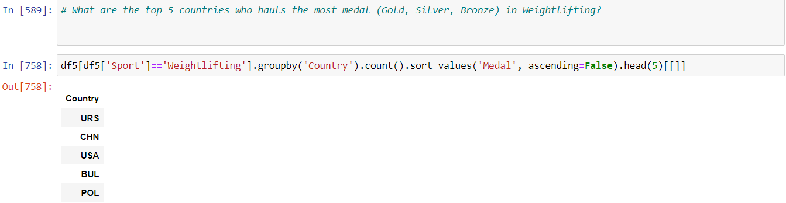
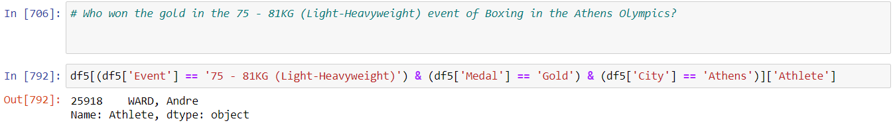

# Python Basics and Data Exploration
#### *DISCLAIMER: This is part of our exercises in Elective Subject as BSCpE students. Credits go to our professor, Dr. Renato R. Maaliw III.*
*Data sets used are available in our professor's GitHub Page, https://github.com/renatomaaliw3/public_files/tree/master/Data%20Sets .*

*To run this notebook, Python 3 and Jupyter Notebook should be installed, which are both available in [Anaconda Package](https://www.anaconda.com/products/distribution).*

*This can also run in [Google Colabs](colab.research.google.com).*

  

### -A set of exercises that I have answered as to represent my skills in basic Python programming, application of it with Math problems, along with data exploration like:
- Importing data from CSV file to Pandas' DataFrame.
  - 
- Showing certain information about the data set.
  - 
- Answering questions about set of data. 
  - 
  - 
